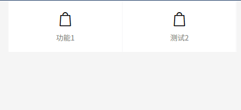

<h1 align="center"> flexwire </h1>

<p align="center"> .</p>


## Installing

```shell
$ composer require liaosp/flexwire -vvv
```

## Usage

````
php artisan vendor:publish --tag=flexwire-assets
php artisan vendor:publish --tag=flexwire-config
````


# Demo

````
class FormController
{
    public function resetCode()
    {
        $content = Content::make()
            ->title('激活码')
            ->banner(['https://s21.ax1x.com/2024/12/31/pAz12M4.png'])
            ->block()
            ->add(new CodeValidateForm());
        return $content->render();
    }

    public function addTestIp()
    {
        $content = Content::make()
            ->title('添加测试IP')
            ->banner(['https://s21.ax1x.com/2024/12/31/pAz12M4.png'])
            ->block()
            ->add(new AddTestIp());
        return $content->render();
    }
}

````
# Form Demo
````

<?php

namespace Liaosp\Flexwire\Http\Form;

use App\Models\Code;
use Illuminate\Support\Carbon;
use Liaosp\Flexwire\Services\Form;
use Liaosp\Flexwire\Services\ToolService;

class CodeValidateForm extends Form
{
    protected $type = 'form';


    public function handle()
    {
        $code = request()->input('code');
    
    
        # todo .. your code  ~~~
           

    }

    public function form()
    {
        $this->text('code', '激活码','');
        $this->submit('重置激活码');
    }

    public function confirm()
    {
        return '重置激活码减少1天有效期';
    }

}

````

# Grid

````
    public function index()
    {
        $content = Content::make()
            ->body(Grid::make([
                GridItem::make('功能1'),
                GridItem::make('测试2'),
            ],2));
        $content->render();
        return $content;
    }

````

# 重写路由
```
# h5为前缀的
Route::prefix('h5')->middleware(['h5.auth'])->group(function (){
    Route::any("/{controller}/{action}",function ($class, $action){

        $class = "App\\H5\\Controllers\\".\Illuminate\Support\Str::studly($class);
        if(class_exists($class))
        {
            $ctrl = \Illuminate\Support\Facades\App::make($class);
            return \Illuminate\Support\Facades\App::call([$ctrl, $action]);
        }
        return abort(404);

    })->where([ 'module'=>'[0-9a-zA-Z]+','class' => '[0-9a-zA-Z]+', 'action' => '[0-9a-zA-Z]+']);
});
```

# 发送验证码

请在 .env 配置

 ```
MAIL_DRIVER=smtp
MAIL_HOST=smtp.qq.com
MAIL_PORT=25
MAIL_USERNAME=xxx@qq.com
MAIL_PASSWORD=xxx
MAIL_FROM_NAME=邮箱提醒
MAIL_FROM_ADDRESS=xxx@qq.com
MAIL_ENCRYPTION=ssl
 ``` 


## Contributing

You can contribute in one of three ways:

1. File bug reports using the [issue tracker](https://github.com/liaoshengping/flexwire/issues).
2. Answer questions or fix bugs on the [issue tracker](https://github.com/liaoshengping/flexwire/issues).
3. Contribute new features or update the wiki.

_The code contribution process is not very formal. You just need to make sure that you follow the PSR-0, PSR-1, and PSR-2 coding guidelines. Any new code contributions must be accompanied by unit tests where applicable._

## License

MIT